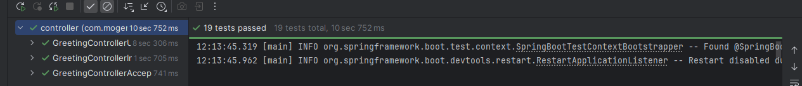

# Simple MyCoolApp Spring Boot project

- Created project using Spring Initializer
- Includes simple REST Controller, Greeting entity, utility classes, beans configurations
- Maven built project structure
  - POM.xml and dependencies like spring web used in the project
    - application.properties - added configurations like

      ``` 
        Defined custom properties, Spring Boot Actuator Endpoints - enable, disable options
        custom definition of Info endpoint, set context path, lazy initialization
      ```

### Dependencies
    Spring Boot 3, Devtools, Security, Actuator, Annotations, JUnit, other imported Spring Framework
    and third party libraries

### Online references

* [StackOverflow](https://www.stackoverflow.com)
* [Medium](https://www.medium.com)
* [Google](https://www.google.com)

### Command Line run

### Tests created
- Unit 
- Integration 
- Acceptance 

  - Test Execution Summary  -  [html_format](TestResults/testExecutionSummary.html)
    - 
    - 

### Key takeaways
- When testing a class that depends on mocked objects, ensure class under test is annotated with
  @InjectMocks